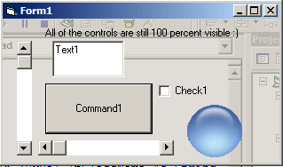



## Translucent Form with 100 percent visible controls

### Description

With this, you can maintain a translucent form background with 100 percent visible controls! This is the Win2k/XP translucency, so it live updates! I came up with the idea for this while I was playing a game on my ps2, and I saw a translucent thing on the screen. And I started thinking about this, and I made it! Please leave feedback!
 
### More Info
 

             |
---                |---
**Submitted On**   |2003-12-28 18:35:32
**By**             |[Jesse Seidel \(Dr\. Fire\)](https://github.com/Planet-Source-Code/PSCIndex/blob/master/ByAuthor/jesse-seidel-dr-fire.md)
**Level**          |Intermediate
**User Rating**    |5.0 (15 globes from 3 users)
**Compatibility**  |VB 6\.0
**Category**       |[Custom Controls/ Forms/  Menus](https://github.com/Planet-Source-Code/PSCIndex/blob/master/ByCategory/custom-controls-forms-menus__1-4.md)
**World**          |[Visual Basic](https://github.com/Planet-Source-Code/PSCIndex/blob/master/ByWorld/visual-basic.md)
**Archive File**   |[Translucen16874712282003\.zip](https://github.com/Planet-Source-Code/jesse-seidel-dr-fire-translucent-form-with-100-percent-visible-controls__1-50640/archive/master.zip)

